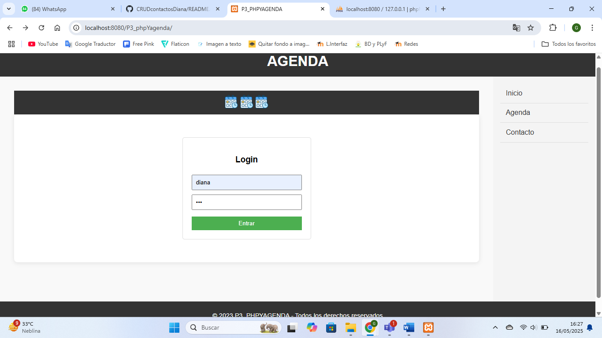

📒CRUDcontactosDiana

## 🛠️ Instalación y ejecución

#### Requisitos:
- Tener descargado XAMPP
- Navegador web
- phpMyAdmin (incluido en XAMPP)

#### Pasos para instalar:
1. Clona o descarga este repositorio.
2. Copia la carpeta `P3_phpYagenda` dentro de: C:\xampp\htdocs\
3. Ejecuta XAMPP y asegúrate de tener los servicios **Apache** y **MySQL** activos.
4. Ahora, vamos a importar la base de datos:
    - Abre phpmyadmin (http://localhost/phpmyadmin)
    - Crea una nueva base de datos llamada `agenda`
    - Ve a la pestaña **Importar**
    - Selecciona el archivo `agenda.sql` incluido en el repositorio
    - Haz clic en **Continuar**
#### Ejecución:
5. Abre tu navegador y entra a: http://localhost/P3_phpYagenda/
    > Si usas otro puerto (ej. `8080`), entra a:  
    > `http://localhost:8080/P3_phpYagenda/`
6. Listo, se podrá ver y probar este proyecto

## 📝 Descripción breve del proyecto
Este proyecto consiste en una aplicación web sencilla desarrollada en HTML, CSS, JS, PHP y MySQL que permite gestionar una agenda de contactos. El sistema permite realizar operaciones CRUD (Crear, Leer, Actualizar y Eliminar) sobre los registros de contactos, facilitando su administración a través de una interfaz básica en el navegador.

## Captura de pantalla inicial

---

## 🎓 Datos académicos

**TECNOLÓGICO NACIONAL DE MÉXICO**  
**Instituto Tecnológico de Orizaba**

👩‍💻 **Alumna:** García Landa Diana  
👩‍🏫 **Docente:** Patricia Quitl González  
📘 **Materia:** 6G5D Programación Web  
📂 **Proyecto:** "CRUD Contactos"  

🗓️ **Periodo:** Enero - Junio 2025  
📍 **Orizaba, Ver.**, a viernes 16 de mayo de 2025

